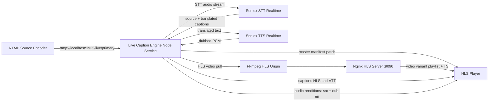
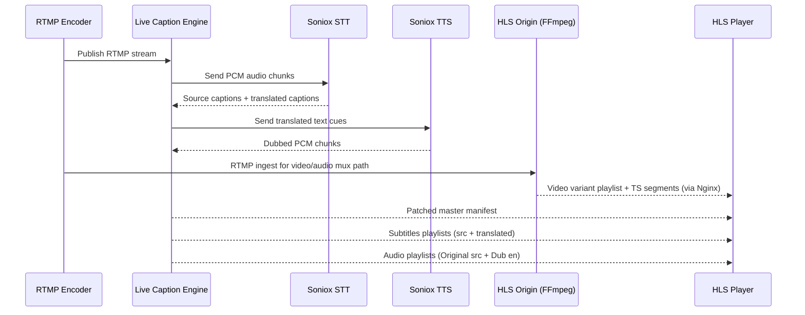
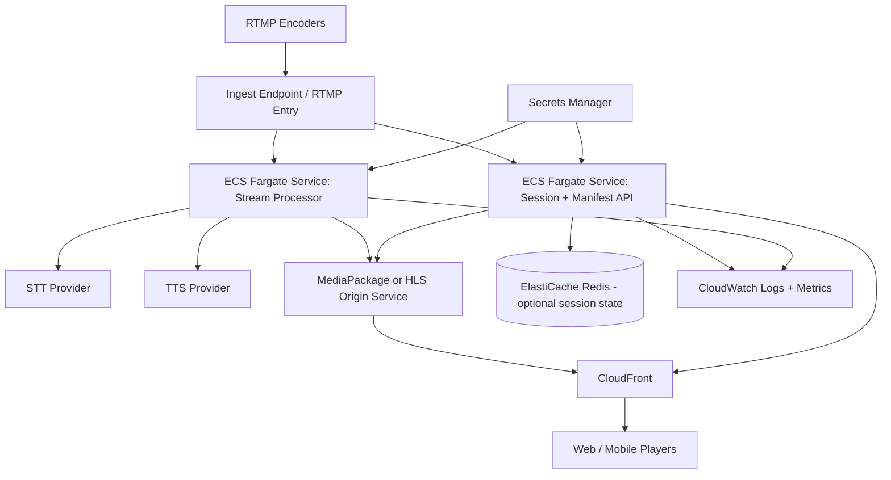

# Live Caption Engine Workflow Architecture

This document describes the runtime workflow architecture for the current local setup and the recommended AWS production setup.

## 1. Current Local Workflow

### Component View

### Data Flow

## 2. Runtime Responsibilities

- Live Caption Engine
  - Session orchestration
  - RTMP ingest processing for STT
  - Translation and dubbing pipeline wiring
  - Captions generation (live and segmented)
  - Audio rendition generation (src and dubbed languages)
  - Master manifest patching

- HLS Origin (FFmpeg + Nginx)
  - Generates video-first HLS variant stream
  - Serves base variant playlist and TS segments

- External AI Providers
  - Soniox STT: transcription and translation
  - Soniox TTS: dubbed audio synthesis

## 3. Recommended AWS Production Architecture

## 4. Scaling and Limits Strategy

- There is no strict language count in code, but practical limits come from:
  - Provider concurrency and quota
  - Task CPU and memory
  - Network throughput and end-to-end latency targets

- For AWS scaling:
  - Scale on active sessions + languages per session + CPU and memory
  - Separate session API and stream processors into distinct services
  - Apply admission controls for max languages per session
  - Prefer graceful degradation: preserve source audio/captions first, then optional dubbed tracks

## 5. Operational Checklist

- Define target concurrency and p95 latency SLO
- Set provider quota alarms and budget alarms
- Add per-session correlation IDs in logs
- Implement readiness checks for:
  - STT stream health
  - TTS stream health
  - HLS rendition freshness
- Load test with multi-language fanout before production rollout
