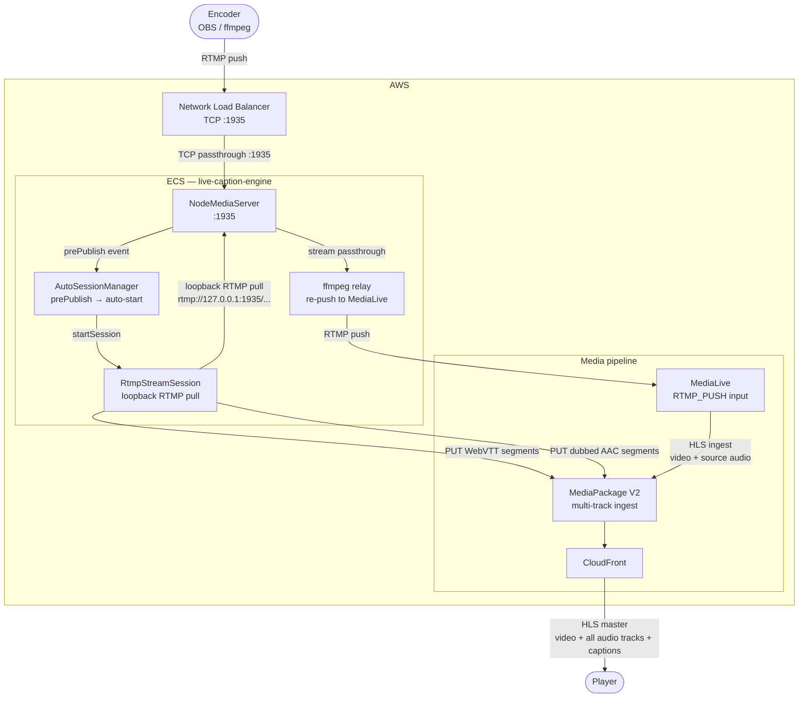
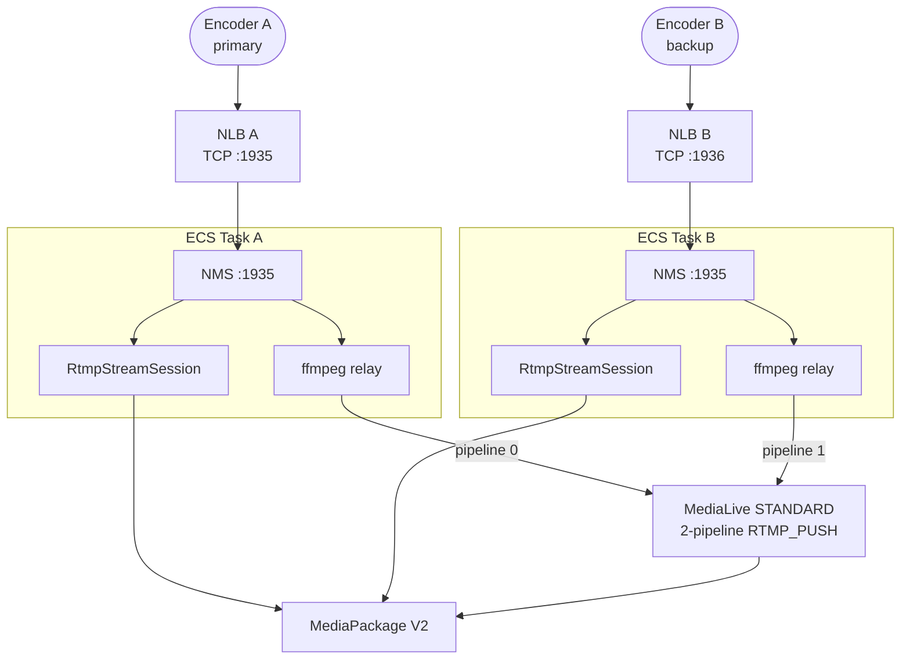

# Optimized Architecture — ECS as RTMP Entry Point

Eliminates the `NginxRtmpStack` EC2 relay entirely.
MediaLive switches from `RTMP_PULL` to `RTMP_PUSH` (its native/recommended input type).
Auto-session trigger is identical to local — no HTTP callback hack needed.

## Diagram

## What changes vs current

| | Current | This |
|---|---|---|
| `NginxRtmpStack` EC2 | Required | **Removed** |
| MediaLive input type | `RTMP_PULL` | `RTMP_PUSH` |
| Auto-session trigger | nginx `on_publish` HTTP callback (not built) | Native `prePublish` event |
| Matches local dev flow | No | **Yes, exactly** |
| Entry point infra | EC2 + EIP | NLB (TCP) |

## STANDARD channel class (dual pipeline)

For `STANDARD` MediaLive class two redundant pipelines are needed.
Each pipeline expects its own RTMP push stream.

For `SINGLE_PIPELINE` (default, cheaper) only Task A / NLB A is needed.
