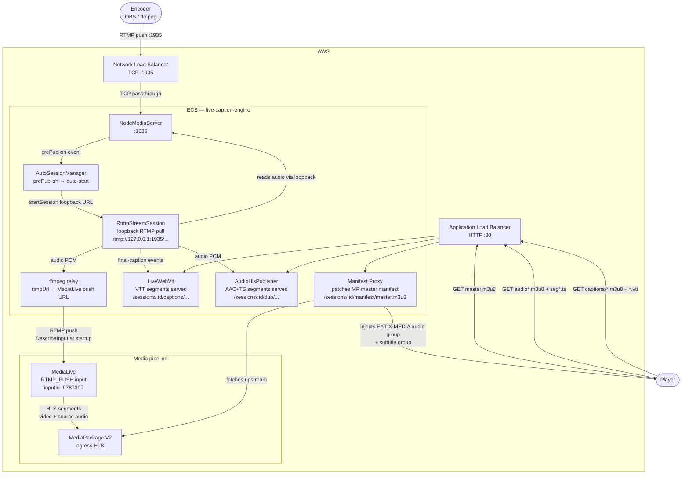
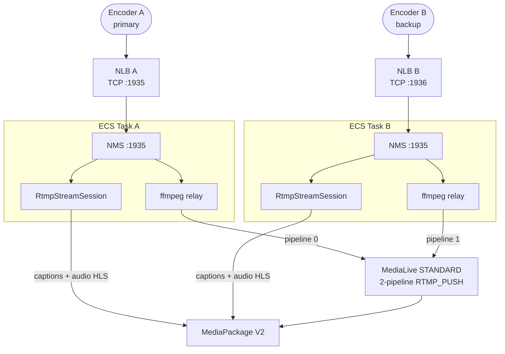
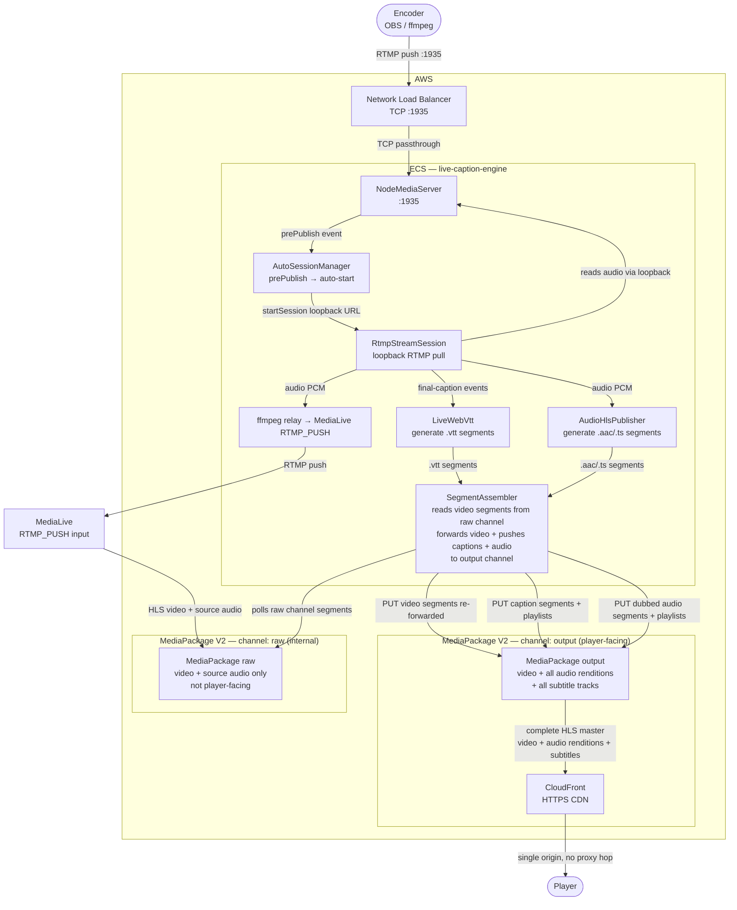

# Architecture

Two workflows are documented here:

1. **Current** — ECS serves tracks locally, a manifest proxy stitches them into the MediaPackage master manifest.
2. **Target** — ECS pushes all tracks directly to MediaPackage V2 ingest; the player talks to a single CloudFront origin with no proxy hop.

---

# Current Architecture — ECS as RTMP Entry Point (deployed)

`NginxRtmpStack` EC2 relay is **removed**.
MediaLive uses `RTMP_PUSH` input — ECS relays the stream via ffmpeg.
Auto-session trigger uses the native NMS `prePublish` event — no HTTP callback needed.
Captions and dubbed audio are served as HLS directly from ECS; a manifest proxy stitches
them into the MediaPackage master manifest so the player sees a single playable URL.

## Current deployed state

| Component | Value |
|---|---|
| ECS service | `live-caption-engine` |
| ECS task definition | `live-caption-engine:23` |
| MediaLive input ID | `9787399` (RTMP_PUSH) |
| MediaPackage origin | `https://p01vso.egress.ahg76l.mediapackagev2.eu-central-1.amazonaws.com/out/v1/live-caption/main/hls` |
| MediaPackage ingest | `https://p01vso-1.ingest.ahg76l.mediapackagev2.eu-central-1.amazonaws.com/in/v1/live-caption/1/main/index` |
| Player master manifest | `http://<ALB>/sessions/<sessionId>/manifest/master.m3u8` |
| Dubbing in production | disabled (`DUBBING_ENABLED=false`) — enable per session via `dubbingLanguages` in API |
| CloudFront | not in front of MediaPackage yet (direct egress URL) |

## Diagram



## Track assembly in the master manifest

The manifest proxy (`/sessions/:id/manifest/master.m3u8`) fetches the raw MediaPackage
master manifest and injects:

```
#EXT-X-MEDIA:TYPE=AUDIO,GROUP-ID="dub-audio",NAME="Original",LANGUAGE="src",DEFAULT=YES,URI="<ALB>/sessions/:id/dub/src/audio.m3u8"
#EXT-X-MEDIA:TYPE=AUDIO,GROUP-ID="dub-audio",NAME="Dub en",LANGUAGE="en",DEFAULT=NO,URI="<ALB>/sessions/:id/dub/en/audio.m3u8"
#EXT-X-MEDIA:TYPE=SUBTITLES,GROUP-ID="subs",NAME="Source",LANGUAGE="src",URI="<ALB>/sessions/:id/captions/index.m3u8"
#EXT-X-MEDIA:TYPE=SUBTITLES,GROUP-ID="subs",NAME="en",LANGUAGE="en",URI="<ALB>/sessions/:id/captions/en/index.m3u8"
...
#EXT-X-STREAM-INF:...,AUDIO="dub-audio",SUBTITLES="subs"
<MediaPackage video variant URL>
```

The player switches audio tracks and subtitle tracks entirely within a single manifest URL.

## Key design decisions

| Decision | Reason |
|---|---|
| ECS serves audio/subtitle HLS locally | No dependency on MediaPackage track ingest; works with standard MP V2 HLS endpoint |
| Manifest proxy stitches tracks | Single playable URL for the player regardless of how many languages are active |
| ffmpeg relay to MediaLive | ECS gets the stream first (for transcription), then pushes a copy to MediaLive for packaging |
| NMS loopback RTMP pull | Session reads audio from the same NMS that received the encoder push; no separate RTMP pull source needed |
| `MEDIALIVE_INPUT_ID` env var | ECS calls `DescribeInput` at startup to resolve the push URL dynamically — survives IP changes |

## SINGLE_PIPELINE (default) vs STANDARD channel class

For `SINGLE_PIPELINE` (default, cheaper): one NLB + one ECS task handles everything.

For `STANDARD` (dual-pipeline, HA), two redundant ECS tasks each relay to one MediaLive pipeline:



Deploy with: `npx cdk deploy --all -c channelClass=STANDARD`

---

# Target Architecture — Two MediaPackage Channels, ECS as Final Assembler

MediaLive and ECS push to **separate** MediaPackage channels — they never share an ingest
endpoint. MediaLive owns the "raw" channel (video + source audio). ECS reads video
segments from that channel, adds captions and dubbed audio it generated, and pushes a
fully assembled stream into a second "output" channel. The player only ever talks to the
output channel via CloudFront.

The ALB manifest proxy is **removed from the player path**.

## Why two channels

MediaPackage V2 expects every ingest client on a channel to agree on segment boundaries
and sequence numbers. MediaLive controls its own clock. If ECS also pushes tracks to the
same channel it creates a conflict — MediaPackage cannot reliably merge them.

With two channels:
- **Channel `raw`** — owned entirely by MediaLive. Clean, unmodified video+audio HLS.
- **Channel `output`** — owned entirely by ECS. Video segments re-forwarded from `raw`,
  plus all caption and dubbed audio renditions. This is the player-facing origin.

## Diagram



## Ingest path layout — output channel

| Track | Ingest sub-path |
|---|---|
| Video (forwarded from raw) | `video` |
| Source captions (WebVTT) | `captions-src` |
| Translated captions e.g. `en` | `captions-en` |
| Original audio rendition (AAC) | `dub-src` |
| Dubbed audio e.g. `en` | `dub-en` |

## What changes in code

| Component | Current | Target |
|---|---|---|
| `AudioHlsPublisher` | writes segments to `/tmp`, serves via Express | hands each segment to `SegmentAssembler` for push to output channel |
| `LiveWebVtt` | serves `.vtt` segments via Express routes | hands each segment to `SegmentAssembler` |
| New: `SegmentAssembler` | — | polls raw MP channel for new video segments, coordinates push of all track types to output channel with matching sequence numbers |
| `manifest-proxy.js` | patches MP master manifest per request | removed from player path; kept optionally for local dev fallback |
| `src/index.js` | starts manifest proxy route | starts `SegmentAssembler` per session instead |

## What changes in CDK / infra

| Resource | Change |
|---|---|
| MediaStack | add second `CfnChannel` + `CfnOriginEndpoint` for `output` channel |
| MediaStack outputs | add `MediaPackageOutputIngestUrl`, `MediaPackageOutputEgressUrl` |
| LiveCaptionStack env | `MEDIAPACKAGE_OUTPUT_INGEST_URL` injected alongside existing `MEDIAPACKAGE_INGEST_URL` |
| CloudFront | enable in front of output channel egress (`output` is player-facing) |
| IAM | ECS task role already has `mediapackagev2:PutObject` — no change needed |

## What stays the same

- RTMP ingest flow (NLB → NMS → auto-session → relay → MediaLive) — no change
- Transcription and dubbing engine pipeline — no change
- Session lifecycle API (`POST /sessions`, `DELETE /sessions/:id`) — no change

## Comparison

| | Current (proxy) | Target (two channels) |
|---|---|---|
| Player origin | ALB (proxy) + MediaPackage (video) | CloudFront → output channel only |
| MediaLive and ECS share ingest | n/a (ECS never writes to MP) | No — separate channels, no conflict |
| Segment alignment | not required | ECS drives from raw channel segment clock — natural alignment |
| ECS restart impact | captions/audio drop immediately | already-pushed segments remain in MP output |
| CloudFront | optional | required (output channel is player-facing) |
| ALB in player path | yes (every segment) | no (session API only) |
| Engineering lift | done | `SegmentAssembler` + second MP channel in CDK |
